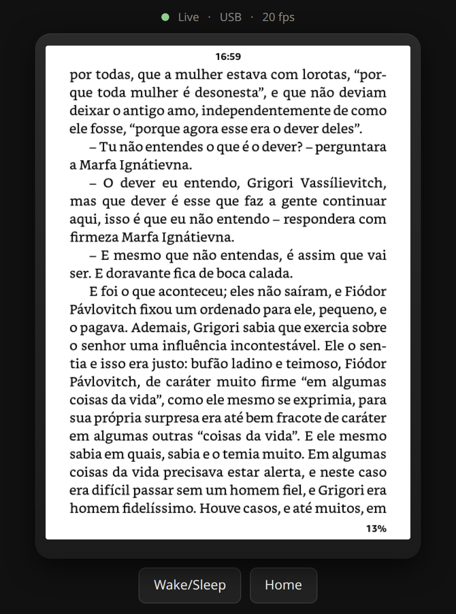

# kindle-remote-screen

<p align="center"></p>

See and control a jailbroken Kindle from your computer's browser: a live
mirror of the e-ink screen plus real touch input (tap, long press, swipe),
the power button and the home button.

It is built for low latency. The mirror only sends what changed, touches go
through a persistent SSH channel, and everything stops when you close the
page, so the Kindle is not kept busy when you are not using it.

> **Tested only on a Kindle 11th generation (2022, KT5), firmware
> 5.19.2.0.1.** Screen resolution and some screen detection are tuned for that
> model. Other models will probably need changes. See [Limitations](#limitations).

## How it works

```
 browser  <--HTTP-->  kindle-remote-screen.py  <--SSH-->  Kindle
 (page)               (your computer)                    fbstream  (screen out)
                                                         ktouch    (touch in)
                                                         lipc      (buttons)
```

- **Screen out:** `fbstream` runs on the Kindle, reads the framebuffer
  (`/dev/fb0`), shrinks it to half size with 16 gray levels (all e-ink shows
  anyway) and writes a frame to stdout only when the picture changed. The
  server reads that over one long-lived SSH connection and keeps the latest
  frame in memory, so the page gets new frames in milliseconds.
- **Touch in:** `ktouch` creates a virtual touchscreen on the Kindle through
  Linux `uinput`. The Kindle's UI sees it as a real finger. The server writes
  one line per gesture (`X Y [hold_ms]` or `S X1 Y1 X2 Y2 ms`) into the
  daemon's input pipe over a second persistent SSH channel.
- **Buttons:** power and home use the Kindle's own `lipc` calls, so nothing
  extra has to listen on the network.
- **Only while you watch:** the screen stream starts when the page asks for a
  frame and stops about 20 s after the page is closed or its tab is hidden.
  While the page is open the server also resets the Kindle's sleep timer once
  a minute (never a sticky "stay awake" flag), so the Kindle does not fall
  asleep while you use it, and the power button still puts it to sleep.

## Why each requirement is needed

| Requirement | Why |
|---|---|
| **Jailbroken Kindle** | Stock Kindles give no shell access. Reading the framebuffer and creating an input device both need root on the device. |
| **SSH access** (e.g. UsbNetLite, installed through KPM) | Everything talks to the Kindle over SSH: the screen stream, the touch channel and the button commands. SSH gives an encrypted, authenticated channel without opening any new port on the Kindle. USB networking is faster and steadier than Wi-Fi, but both work. |
| **SSH key login** and a host entry in `~/.ssh/config` | The server opens SSH sessions on its own and cannot type a password. A host alias (default `kindle`) keeps IPs out of the code. |
| **ARM cross-compiler** (`arm-linux-gnueabihf-gcc`) | `ktouch` and `fbstream` run on the Kindle's ARM CPU. They are built as static binaries so they need no libraries on the device. |
| **Python 3 + Pillow** (numpy optional, faster) | The server converts the raw 4-bit frames into PNG images for the browser and checks whether a gesture changed the screen. |
| **`kindle-setup.sh` after each Kindle boot** | The virtual touchscreen and the udev rule that makes the Kindle's X server accept it live in RAM, so a reboot removes them. That is on purpose: nothing is written to the Kindle's system partition. |

## Setup

1. Jailbreak the Kindle and install an SSH package (this project was used with
   SpiderCat + KPM + UsbNetLite). Follow the instructions of those projects.
2. Put your public key on the Kindle and add a host entry, for example:

   ```
   Host kindle
       HostName 192.168.15.244     # USB network address, or the Wi-Fi one
       User root
       IdentityFile ~/.ssh/kindle_ed25519
       ControlMaster auto
       ControlPath ~/.ssh/cm-%r@%h:%p
       ControlPersist 10m
   ```

   `ControlMaster` is optional but makes buttons and the first tap faster.
3. Get the Kindle binaries into `/mnt/us` (the user storage). Either download
   `ktouch` and `fbstream` from the
   [Releases](https://github.com/kbrianps/kindle-remote-screen/releases) page:

   ```
   sudo apt install python3-pil python3-numpy
   scp ktouch fbstream kindle:/mnt/us/ && ssh kindle 'chmod +x /mnt/us/ktouch /mnt/us/fbstream'
   ```

   or build them yourself:

   ```
   sudo apt install gcc-arm-linux-gnueabihf python3-pil python3-numpy
   make
   make install HOST=kindle
   ```

4. After each Kindle boot, start the virtual touchscreen:

   ```
   scripts/kindle-setup.sh kindle
   ```

5. Start the server and open the page:

   ```
   ./kindle-remote-screen.py --host kindle
   # open http://127.0.0.1:8777
   ```

The top bar shows `USB` when the host address is on the Kindle's USB network
(192.168.15.x) and `Wi-Fi` otherwise; `--label` overrides it.

The server listens only on `127.0.0.1`, so the page is reachable from your
computer only.

## Usage

| Action on the page | On the Kindle |
|---|---|
| Click | Tap |
| Click and hold still | Long press |
| Click and drag | Finger swipe (scrollbars, lists, anything draggable) |
| Right click | Long press |
| Mouse wheel | Taps the scroll arrow if one is visible; turns the page in a book |
| Shift + wheel, arrow keys, PageUp/PageDown, Space | Turns the page (only inside a book) |
| Home key or **Home** button | Home screen |
| **Wake/Sleep** button | Power button |

The mouse wheel never taps blindly: if it cannot find a scroll arrow or a
book page, it does nothing.

## Risks and known issues

- **You need a jailbreak.** Jailbreaking has its own risks and may void
  warranty. Do not update the Kindle firmware afterwards unless the jailbreak
  community says the new version is safe.
- **Never stop `ktouch` while the Kindle UI is running.** Removing a virtual
  input device made the Kindle's old Xorg (1.8, evdev 2.4) crash once. It
  respawned by itself and `kindle-setup.sh` brings the UI back, but avoid it:
  let a reboot clean it up instead.
- **Taps are real taps.** Whatever you click is pressed on the Kindle,
  including the Store and "Buy" buttons.
- **Battery:** while the page is open the Kindle is kept awake and streams its
  screen. Close the page (or switch tabs) when you are done.
- Nothing here changes the Kindle's system partition. Binaries live in
  `/mnt/us`, runtime state in `/tmp` and `/dev/.udev` (RAM).

## Limitations

- Resolution is fixed at 1072x1448 (Kindle 11th gen) in the server and in both
  C programs.
- Scroll arrow and "is this a book page" detection are tuned for the
  firmware 5.19 UI.
- The page shows the screen at half resolution with 16 gray levels.

## Project layout

```
kindle-remote-screen.py   server + web page (Python, stdlib + Pillow)
kindle/fbstream.c         framebuffer stream (runs on the Kindle)
kindle/ktouch.c           virtual touchscreen daemon (runs on the Kindle)
scripts/kindle-setup.sh   per-boot setup on the Kindle
Makefile                  cross-compile and install the Kindle binaries
```

## License

GPL-3.0-or-later. See [LICENSE](LICENSE). You may use, study, change and
share this project; if you distribute a modified version, you must publish its
source under the same license.
